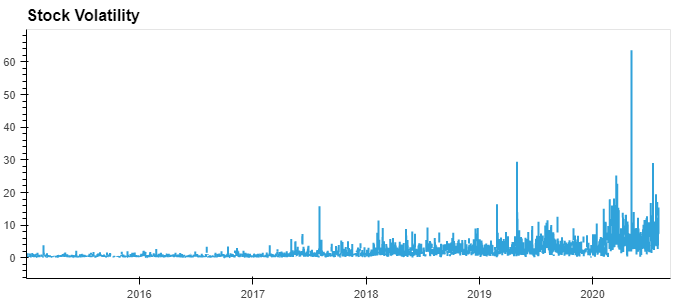

# Forecasting-Net-Prophet

The data science manager asks if the Google search traffic for the company links to any financial events at the company. Or, does the search traffic data just present random noise? To answer this question, pick out any unusual patterns in the Google search data for the company, and connect them to the corporate financial events.

* I read the search data into a DataFrame, and then slice the data to just the month of May 2020. (During this month, MercadoLibre released its quarterly financial results.) I use hvPlot to visualize the results. Do any unusual patterns exist?

There was a slight increase in the search traffic at the begining of May. We see a similar and steady pattern the rest of the month.

## Mine the Search Traffic Data for Seasonality

Marketing realizes that they can use the hourly search data, too. If they can track and predict interest in the company and its platform for any time of day, they can focus their marketing efforts around the times that have the most traffic. This will get a greater return on investment (ROI) from their marketing budget.

* I group the data into week days and visualize the search trends

We see the search trend high at the start of  the week and drop towards the end of the week.

* A heatmap is used to visualize what time of the day has the most traffic

Most concentration in day two to four of the week and in the first three and last two hours of the day.

* Which season has the most traffic

We start noticing an increase in search traffic during the holiday seasons the lasts most of the winter months. 

## The Finance group wants to know if any relationship between the search data and the company stock price exists. 
* Market events emerged during the year of 2020 that many companies found difficult. But, after the initial shock to global financial markets, new customers and revenue increased for e-commerce platforms. 
* I Review the data and visualize time series correlation to series to find any indixation of a common trend that’s consistent with this narrative?
* I review the data using the first half of the year

We see the close price support the narrative as the price gradualy increased after the initial shock. We see the search trend indicate the effects of the shock as well with a dropin the third month and recovery there after. The search trend visual indicates a slight increase in customers especialy in the fifth months. The increase in customers is neither constanct nor significant compaired to the number of customers at the start of the year.

## Create a new column in the DataFrame named “Lagged Search Trends” that offsets, or shifts, the search traffic by one hour. Create two additional columns:
* “Stock Volatility”, which holds an exponentially weighted four-hour rolling average of the company’s stock volatility

* “Hourly Stock Return”, which holds the percent change of the company's stock price on an hourly basis

Note how volatility spiked, and tended to stay high, during the first half of 2020. This is a common characteristic of volatility in stock returns worldwide: high volatility days tend to be followed by yet more high volatility days. When it rains, it pours.

The time series Correlation showed no Predictive relatioship between the lagged search traffic and nd the stock volatility or between the lagged search traffic and the stock price returns.

## Create a Time Series Model with Prophet and Predict future trends for MercadoLibre

The near-term forecast for the MercadoLibre is indicating a drop in popularity.

### Visual of predictive worst case, actual and best case senario base on 95%

### Visualizing future trends by year, day and week

* The greatest popularity  happens in the early morning and in the evening.
* Tuesday has the most search traffic
* The lowest search traffic in the year takes a place in November
